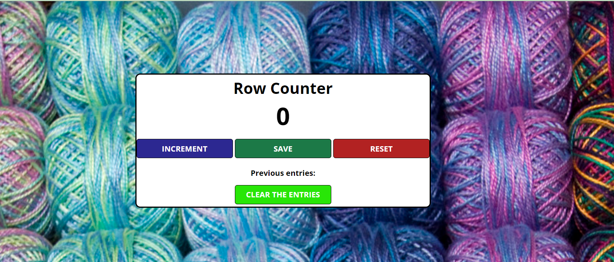

Quick start:

```
$ npm install
$ npm start
````

Happy Coding!

# Scrimba Javascript Course Section Project 
## Counter App

<h3>Project Explanation</h3>
Reviewed by:
- Script Tag
- Variables
- Numbers
- Strings
- console.log()
- functions
- The DOM
- getElementById()
- innerText
- textContent

<h3>Project Photo</h3>
<p>
  <a target="_blank"  rel="noreferrer">   
  